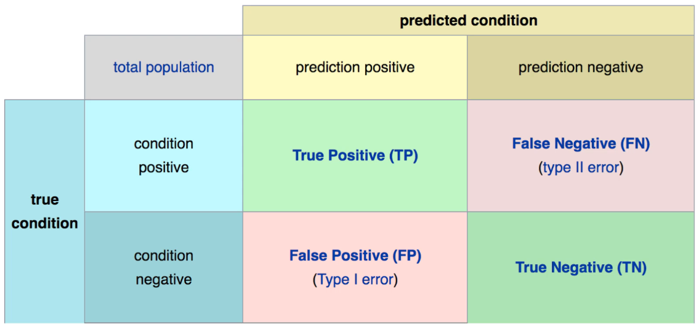

# Spark

Apache Spark is an open-source distributed general-purpose cluster-computing framework. Spark provides an interface for programming entire clusters with implicit data parallelism and fault tolerance.

Features of Python
- Easy-to-learn
- Easy-to-read
- Easy-to-maintain
- A broad standard library
- Interactive Mode
- Portable
- Extendable
- Databases
- GUI Programming
- Scalable

Features of Spark
- Speed
- Ease of Use
- A Unified Engine
- Multiple Languages
- Advanced Analytics

Basics of PySpark 
- SparkSession
- SparkContext
- SparkConf
- SparkFiles
- SparkJobInfo
- SparkStageInfo
- SparkListener
- SparkListenerJobStart
- SparkListenerStageCompleted
- SparkListenerTaskStart

## Logistic Regression

Logistic regression is a statistical model that in its basic form uses a logistic function to model a binary dependent variable, although many more complex extensions exist. In regression analysis, logistic regression (or logit regression) is estimating the parameters of a logistic model (a form of binary regression).
Logistic regression is used to describe data and to explain the relationship between one dependent binary variable and one or more nominal, ordinal, interval or ratio-level independent variables.

Sigmoind Function : The sigmoid function, also called the sigmoidal curve (von Seggern 2007, p. 334) or logistic function, is the function

Confusion Matrix : A confusion matrix is a table that is often used to describe the performance of a classification model on a set of test data for which the true values are known.

NO = Negaitve = False = 0
YES = Positive = True = 1

True Positive (TP) : Observation is positive, and is predicted to be positive.
False Negative (FN) : Observation is positive, but is predicted negative.
True Negative (TN) : Observation is negative, and is predicted to be negative.
False Positive (FP) : Observation is negative, but is predicted positive.

Accuracy : Accuracy is the most intuitive performance measure and it is simply a ratio of correctly predicted observation to the total observations.

(TP+TN)/total = Correct Accuracy
(FP+FN)/total = Error Rate

ROC Curve : A receiver operating characteristic curve, or ROC curve, is a graphical plot that illustrates the diagnostic ability of a binary classifier system as its discrimination threshold is varied.

## Tree Methods

Decision Tree : A decision tree is a flowchart-like structure in which each internal node represents a "test" on an attribute (e.g. whether a coin flip comes up heads or tails), each branch represents the outcome of the test, and each leaf node represents a class label (decision taken after computing all attributes).

Random Forest : Random forests or random decision forests are an ensemble learning method for classification, regression and other tasks that operate by constructing a multitude of decision trees at training time and outputting the class that is the mode of the classes or mean prediction of the individual trees.

Gradient Boosted Trees : Gradient boosting is a machine learning technique for regression and classification problems, which produces a prediction model in the form of an ensemble of weak prediction models, typically decision trees.
  - A loss function to be optimized.
  - A weak learner to make predictions.
  - An additive model to add weak learners to minimize the loss function.

## Clustering

K Means Clustering : K-means clustering is a method of vector quantization, originally from signal processing, that aims to partition n observations into k clusters in which each observation belongs to the cluster with the nearest mean (cluster centers or cluster centroid), serving as a prototype of the cluster.

## Collaborative Filtering

Collaborative filtering (CF) is a technique used by recommender systems. Collaborative filtering has two senses, a narrow one and a more general one. In the newer, narrower sense, collaborative filtering is a method of making automatic predictions (filtering) about the interests of a user by collecting preferences or taste information from many users (collaborating). The underlying assumption of the collaborative filtering approach is that if a person A has the same opinion as a person B on an issue, A is more likely to have B's opinion on a different issue than that of a randomly chosen person. In the older, broader sense, collaborative filtering is the process of filtering for information or patterns using techniques involving collaboration among multiple agents, viewpoints, data sources, etc.

## Natural Language Processing

Natural language processing (NLP) is a subfield of linguistics, computer science, and artificial intelligence concerned with the interactions between computers and human language, in particular how to program computers to process and analyze large amounts of natural language data.

## Spark Streaming

Spark Streaming is an extension of the core Spark API that enables scalable, high-throughput, fault-tolerant stream processing of live data streams. Data can be ingested from many sources like Kafka, Flume, Kinesis, or TCP sockets, and can be processed using complex algorithms expressed with high-level functions like map, reduce, join and window.

